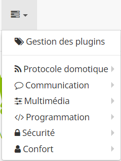

I've a Raspberry used for domotics (with a Razberry). One of my needs what's how to set an alarm using a Fibaro Presence Sensor and a Neocoolcam Siren. I'm going to explain how to do it!

Prerequisites: If you want to see how to setup Telegram for communication please read 

## Plugin installation

1. First of all download 'Siren' plugin from Jeedom. Gestion des plugins 

2. Activate it

## Setup Alarm

1. Go to plugins menu (fourth option from left) and select 'Sécurité>Alarme'
1. Press 'Ajouter' and choose the name for the alarm
1. Check options:

	- Activer
	- Visible
	- Armement visible (to enable or disable alarm from dashboard)
	- Status immédiat visible

1. Define a 'Mode' (at tab 'Modes') that will allow us to activate alarm or deactivate from dashboard when we leave from home

	- Press 'Ajouter mode'
	- Create a name, for example 'Exit home'

## Zones creation

1. From menu 'Zones' define the zones that the alarm has to look out. For each zone:
	
	- Press 'Ajouter zone'
	- Edit a name zone ('Living room zone', for example)
	- Click 'Déclencheur' and select the equipment and the commande that defines trigger for presence or sensor

	For example if you've a Fibaro Sensor like me:

	

	After creation we can define how much time we've to leave home before the condition is checked at 'Activation' field (in minutes) and in 'Declencher' what is the time the actions will be executed after condition is true (if for example a presence is detected and we set 1 minutes for Declencher the actions will be executed after 1 minute)

	I set 'Activation' to 3 minutes for the zone near my exit door, but 0 minutes for window sensors.

	- Press 'Action immediate' to define an action that has to be launched if previous condition is true. For example, if I want to beep the siren: 

		* Select the mode we've created ('Exit home')
		* Enable the two checks
		* On the second button select the commande to activate the alarm.
		For example, for a Neocoolcam siren:

		

	- Press 'Action' to create for example a Telegram message

		* Press second button and select equipment 'Telegram'
		* In 'Message field' enter a message like 'Intruder in living home'

Repeat the process for each zone and equipment.

1. Return to 'Mode' and add with button '+Zone' all created zones

## Configure messages to receive when alarm is activated and deactivated

1. Select 'Activation OK' tab. Here we're going to set what to do when we activate the alarm

	- I want for example to receive a telegram message immediately when I activate the alarm, so I press "Ajouter action immediate lors de l'activation" and select 'Telegram' equipment and the message I want to receive to my bot

	- Also I want to receive a telegram message after the real activation (we've defined it in field 'Activation' at zone), so I press 'Ajouter action lors de l'activation'

	

1. Select 'Deactivation OK' and define a telegram message when we deactivate the alarm

## Activate the alarm

1. Go to dashboard (we see the alarm plugin and the padlock open)

1. Press padlock to activate alarm (the padlock then is shown closed)

Remember you need to leave before the 'Activate' field...